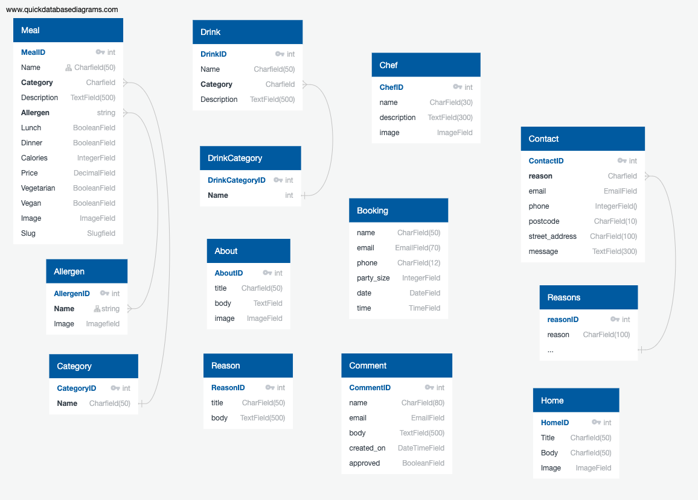

# Elgini's Restaurant
(Developer: Daniel Richards)


[View live site](https://elginis-restaurant.herokuapp.com/)

## Table of Content

1. [Project Goals](#project-goals)
    1. [User Goals](#user-goals)
    2. [Site Owner Goals](#site-owner-goals)
2. [User Experience](#user-experience)
    1. [Strategy](#strategy)
        + [Primary Goal](#primary-goal)
    2. [Structure](#structure)
        + [Website pages](#website-pages)
        + [Code Structure](#code-structure)
        + [Database](#database)
        - [Physical database model](#physical-database-model)
        - [Models](#models)
            * [User Model](#user-model)
            * [Meal Model](#meal-model)
            * [Category Model](#category-model)
            * [Allergen Model](#allergen-model)
            * [Drink Model](#drink-model)
            * [DrinkCategory Model](#drinkcategory-model)
            * [Comment Model](#comment-model)
            * [Booking Model](#booking-model)
            * [Contact Model](#contact-model)
            * [Reason Model](#reason-model)
            * [About Model](#about-model)
            * [Chef Model](#chef-model)
            * [Reasons Model](#reasons-model)
            * [Home Model](#home-model)
    <!-- 1. [Target Audience](#target-audience)
    2. [User Requirements and Expectations](#user-requirements-and-expectations) -->
    3. [Scope](#scope)
        +[User Stories](#user-stories)
    4. [Skeleton](#design)
        1. [Wireframes](#wireframes)
    5. [Surface](#surface)
        1. [Design Choices](#design-choices)
        2. [Colour](#colours)
        3. [Fonts](#fonts)


5. [Technologies Used](#technologies-used)
    1. [Languages](#languages)
    2. [Frameworks & Tools](#frameworks-&-tools)
6. [Features](#features)
7. [Testing](#validation)
    1. [HTML Validation](#HTML-validation)
    2. [CSS Validation](#CSS-validation)
    3. [JS Validation](#JS-validation)
    4. [Accessibility](#accessibility)
    5. [Performance](#performance)
    6. [Device testing](#performing-tests-on-various-devices)
    7. [Browser compatibility](#browser-compatibility)
    8. [Testing user stories](#testing-user-stories)
8. [Bugs](#Bugs)
10. [Deployment](#deployment)
11. [Credits](#credits)
12. [Acknowledgements](#acknowledgements)

# User Experience
## Strategy
### Primary Goal
The primary goal of the website from the site 
owners perspective is as follows:
- To attract customers to the business by showing an attractive and appealing variety of food.
- To allow a user to navigate the website and see food options easily
- To allow a user to make a reservation

The primary goal of the website from a site users perspective is as follows:
- To view the restaurants menu
- To view details about food dishes, including allergens, description and prices
- To be able to filter dishes by allergies
- To make a reservation
- To contact the restaurant
- To view opening hours
- To post a review or comment about their experience
- To view other customer’s reviews and comments

## Structure
### Code Structure
The project is organised into a variety of applications, as is constructed using the Django Framework.

App details as follows:
- Home - this app contains information about the restaurant home page with quick links to the menus on page and table booking via the nav bar.
- Meals - this app contains the menu structure, users can choose between the lunch drink and dinner menu.  Clicking individual items opens a sub  page where users can see detailed food information including allergens and calories.
- About - this app contains information relating to the business heritage the opportunity for users to view, add, edit, delete comments with authentication.
- Contact - this app is for users to be able to submit a message to the site owners and recieve acknowledgment.
- Booking - this app is for users to be able to submit a booking reqeuest with date validation so cannot be booked in past and also only within restaurant opening hours.

To complement the apps there are
- project: Project level files - settings.py for project level settings and urls.py to route the website URLS
- templates: Containing the base.html, allauth(django authentication)
- templates (app level): each app has it's own templates directory for HTML to consider portability and re-use.
- urls (app level): each app has it's own url.py file to consider portability and re-use.
- static: Base css and Javascript files
- manage.py: This file is used to start the site and perform funcions during development
- README.md: Readme documentation
- Procfile: To run the application on Heroku
- Requirements.txt: Containing the project dependencies
Note: Environment variable values are not exposed in the source code, they are stored locally in env.py that is not checked in(and listed in .gitignore, and on Heroku in app settings


Physical database model

This model contains all fields stored in the database collections with their data type and mimics the structure of what is actually stored in the Postgres database 
<br>

#### Models
- The following models were created to represent the database model structure for the website

##### User Model
- The User model contains information about the user. It is part of the Django allauth library
- The model contains the following fields: username, password, first_name, last_name, email, is_staff, is_active, is_superuser, last_login, date_joined

##### Meal Model
- The Meal model contains information about meals available within each of the menus
- It contains Category as a foreign-key.
- It contains Allergen as a Many-toMany relationship.
- The model contains the following fields:  Name, Category, Description, Allergen, Lunch, Dinner, Calories, Price, Vegetarian, Vegan, Image, Slug.

##### Category Model
- The category model contains the available categories for a meal item
- The model contains the following fields: name

##### Allergen Model
- The Allergen model contains allergens that may be contained in the meals, this has a many to many relationship with meals model.
- It contains images so to be easily understood to non english speakers.
- The model contains the following fields: name, image.

##### Drink Model
- The Drink model contains a the drinks available at the restaurant
- It has DrinkCategory as a foreign-key.
- The model contains the following fields: name, description, category, image.

##### DrinkCategory Model
- The News model contains viable categories for the drinks.
- It acts as a foreign-key for Drinks model
- The model contains the following fields: name

##### Comment Model
- The News model contains a comment that renders on the about page.
- The model contains the following fields: user, comment_text, created_date

##### Booking Model
- The Booking model contains a collection of data submitted by the user when requesting a reservation.
- The model contains the following fields: name, email, phone, party_size, date, ,time

##### Contact Model
- The Contact model contains a collection of data submitted by the user when messaging the site owner.
- It contains Reasons as a foreign-key.
- The model contains the following fields: reason, email, phone, postcode, street_address, message.

#### Reason Model
- The Contact model contains a collection pre configured headers that the user can use to send the message.
- It acts as a foreign-key for Contact model.
- The model contains the following fields: reason

#### About Model
- The About model contains a collection of data and image to show the restaurant heritage..
- The model contains the following fields: title, body, image.

#### Reasons Model
- The Reasons model contains a collection reasons as to why the user should use the establishment.
- The model contains the following fields: reason, body.

#### Chefs Model
- The Chefs model contains the chef images, names and biography.
- The model contains the following fields: name, image, bio.

#### Home Model
- The Home model contains the items for the carousel on the home page.
- The model contains the following fields: Title, body, image.

## Scope
### User stories:

#### First time user
1. As a first time user, I want to be able to view the type of food the restaurant provides
2. As a first time user, I want to see professional and appealing images of the food
3. As a first time user, I want to be able to navigate the website quickly and easily
4. As a first time user, I want to be able to view the full menu
5. As a first time user, I want to be able to view food allergies
6. As a first time user, I want to be able to view a description and price of the food 
7. As a first time user, I want to be able to leave a comment or review
8. As a first time user, I want to be able to see other user’s comments and reviews
9. As a first time user, I want to be able to edit and delete a comment I have made
10. As a first time user, I want to be able contact the restaurant
11. As a first time user, I want to be able to make a reservation
12. As a first time user, I want to be able to view the restaurants location and opening hours
13. As a first time user, I want to know about the business and it’s ethos
14. As a first time user, I want to be able to see any special events and offers

#### Site Owner
15. As a site owner, I want to attract customers to our restaurant
16. As a site owner, I show appealing and professional images of our food
17. As a site owner, I want users to be to view our full menu
18. As a site owner, I want users to be able to view the food descriptions and prices
19. As a site owner, I want users to be able to view allergies
20. As a site owner, I want users to be able to make a reservation
21. As a site owner, I want users to be able to leave a comment or review
22. As a site owner, I want users to be able to view other comments and reviews
23. As a site owner, I want users to be able to edit and delete comments or reviews
24. As a site owner, I want users to be able to contact the business
25. As a site owner, I want users to be able to view the location and opening times
26. As a site owner, I want users to be able to find out about our business ethos
27. As a site owner, I want users to be able to have an idea of the restaurant’s welcoming atmosphere so they will make a reservation
28. As a site owner, I want users to be able to navigate the site easily and quickly
29. As a site owner, I want to be able to promote special offers and events.


## Surface
### Design choices

The overall design of the website was to keep it clean and simple, to allow the imagery of the food to shine through, and to choose colours that didn’t distract or take focus. The website also needs to act as a portfolio to attract users to book and visit the restaurant, so we chose a gallery image layout for the menu, and made sure to include photography of the staff and restaurant interior.

The site is straightforward to navigate, with a high contrasting navigation bar to enable ease of use for the user to find other main pages.

The background is neutral but bright, the images are the focal point of the home page so the user has an immediate view of the food. The rest of the colour scheme is reflecting the rustic Italian interior of the restaurant.

### Colours

The colour palette is fairly neutral and warm. The bold colours that are used in focal points such as buttons and titles, and the neutrals are used for backgrounds and body text.

- #212529 - Title text
- #4F4F4F - Body text
- #5A753A - Buttons
- #703D30 - Lines and subtitles
- #FBF4E1 - Background
- #FFFFFF  - Logo and header links

After choosing a colour scheme I tested a number of palette options to make sure the it met accessibility standards.

<br>


<!-- 

Welcome USER_NAME,

This is the Code Institute student template for Gitpod. We have preinstalled all of the tools you need to get started. It's perfectly ok to use this template as the basis for your project submissions.

You can safely delete this README.md file, or change it for your own project. Please do read it at least once, though! It contains some important information about Gitpod and the extensions we use. Some of this information has been updated since the video content was created. The last update to this file was: **September 1, 2021**

## Gitpod Reminders

To run a frontend (HTML, CSS, Javascript only) application in Gitpod, in the terminal, type:

`python3 -m http.server`

A blue button should appear to click: _Make Public_,

Another blue button should appear to click: _Open Browser_.

To run a backend Python file, type `python3 app.py`, if your Python file is named `app.py` of course.

A blue button should appear to click: _Make Public_,

Another blue button should appear to click: _Open Browser_.

In Gitpod you have superuser security privileges by default. Therefore you do not need to use the `sudo` (superuser do) command in the bash terminal in any of the lessons.

To log into the Heroku toolbelt CLI:

1. Log in to your Heroku account and go to *Account Settings* in the menu under your avatar.
2. Scroll down to the *API Key* and click *Reveal*
3. Copy the key
4. In Gitpod, from the terminal, run `heroku_config`
5. Paste in your API key when asked

You can now use the `heroku` CLI program - try running `heroku apps` to confirm it works. This API key is unique and private to you so do not share it. If you accidentally make it public then you can create a new one with _Regenerate API Key_.

------

## Release History

We continually tweak and adjust this template to help give you the best experience. Here is the version history:

**September 1 2021:** Remove `PGHOSTADDR` environment variable.

**July 19 2021:** Remove `font_fix` script now that the terminal font issue is fixed.

**July 2 2021:** Remove extensions that are not available in Open VSX.

**June 30 2021:** Combined the P4 and P5 templates into one file, added the uptime script. See the FAQ at the end of this file.

**June 10 2021:** Added: `font_fix` script and alias to fix the Terminal font issue

**May 10 2021:** Added `heroku_config` script to allow Heroku API key to be stored as an environment variable.

**April 7 2021:** Upgraded the template for VS Code instead of Theia.

**October 21 2020:** Versions of the HTMLHint, Prettier, Bootstrap4 CDN and Auto Close extensions updated. The Python extension needs to stay the same version for now.

**October 08 2020:** Additional large Gitpod files (`core.mongo*` and `core.python*`) are now hidden in the Explorer, and have been added to the `.gitignore` by default.

**September 22 2020:** Gitpod occasionally creates large `core.Microsoft` files. These are now hidden in the Explorer. A `.gitignore` file has been created to make sure these files will not be committed, along with other common files.

**April 16 2020:** The template now automatically installs MySQL instead of relying on the Gitpod MySQL image. The message about a Python linter not being installed has been dealt with, and the set-up files are now hidden in the Gitpod file explorer.

**April 13 2020:** Added the _Prettier_ code beautifier extension instead of the code formatter built-in to Gitpod.

**February 2020:** The initialisation files now _do not_ auto-delete. They will remain in your project. You can safely ignore them. They just make sure that your workspace is configured correctly each time you open it. It will also prevent the Gitpod configuration popup from appearing.

**December 2019:** Added Eventyret's Bootstrap 4 extension. Type `!bscdn` in a HTML file to add the Bootstrap boilerplate. Check out the <a href="https://github.com/Eventyret/vscode-bcdn" target="_blank">README.md file at the official repo</a> for more options.

------

## FAQ about the uptime script

**Why have you added this script?**

It will help us to calculate how many running workspaces there are at any one time, which greatly helps us with cost and capacity planning. It will help us decide on the future direction of our cloud-based IDE strategy.

**How will this affect me?**

For everyday usage of Gitpod, it doesn’t have any effect at all. The script only captures the following data:

- An ID that is randomly generated each time the workspace is started.
- The current date and time
- The workspace status of “started” or “running”, which is sent every 5 minutes.

It is not possible for us or anyone else to trace the random ID back to an individual, and no personal data is being captured. It will not slow down the workspace or affect your work.

**So….?**

We want to tell you this so that we are being completely transparent about the data we collect and what we do with it.

**Can I opt out?**

Yes, you can. Since no personally identifiable information is being captured, we'd appreciate it if you let the script run; however if you are unhappy with the idea, simply run the following commands from the terminal window after creating the workspace, and this will remove the uptime script:

```
pkill uptime.sh
rm .vscode/uptime.sh
```

**Anything more?**

Yes! We'd strongly encourage you to look at the source code of the `uptime.sh` file so that you know what it's doing. As future software developers, it will be great practice to see how these shell scripts work.

---

Happy coding!


----------------------------------------------------------------------------------------------------------------------------

 -->
